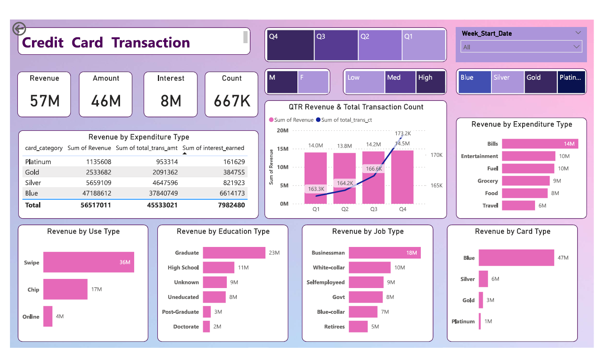

# Credit Card Financial Dashboard



## Table of Contents
- [Overview](#overview)
- [Features](#features)
- [Installation](#installation)
- [Usage](#usage)
- [Data Sources](#data-sources)
- [Visualization Details](#visualization-details)
- [Project Insights](#project-insights)
- [Data Import to SQL](#data-import-to-sql)
- [DAX Queries](#dax-queries)
- [Contributing](#contributing)
- [License](#license)
- [Contact](#contact)

## Overview
The Credit Card Financial Dashboard is a Power BI project designed to provide insightful visualizations and analysis of credit card transactions. The dashboard tracks spending patterns, and analyze financial trends over time.

## Features
- **Spending Overview:** Visual breakdown of spending categories.
- **Transaction History:** Detailed view of all credit card transactions.
- **Weekly and Total Revenue Analysis:** Track weekly revenue changes and overall revenue performance.

## Installation
To view and interact with the dashboard, follow these steps:

1. **Clone the Repository:**
    ```bash
    git clone https://github.com/Anupam2209/Credit_Card_Financial_Dashboard.git
    ```
2. **Open Power BI:**
    - Download and install [Microsoft Power BI Desktop](https://powerbi.microsoft.com/desktop/).
3. **Load the Dashboard:**
    - Open the `.pbix` file from the cloned repository in Power BI Desktop.

## Usage
Once the dashboard is loaded in Power BI Desktop, you can interact with various visualizations:

- **Filter Data:** Use the filters to view data for specific time periods or categories.
- **Drill Down:** Click on charts and graphs to drill down into detailed data.
- **Export Reports:** Export visualizations and data summaries as needed.

## Data Sources
The dashboard uses the following data sources:

- **Credit Card Statements:** CSV files containing transaction details.


Ensure that your data sources are configured correctly in Power BI for the dashboard to function properly.

## Visualization Details
The dashboard consists of several key visualizations:

- **Key Cards:** Display important financial metrics such as total revenue, transaction amount, and customer count.
- **Line Graph:** Displays the trend of monthly revenue with respect to gender.
- **Bar Chart:** Shows the comparison of spending across different categories.
- **Table:** Detailed transaction history with filters for easy searching.

## Project Insights

### Week 53 (31st Dec)
- **WoW change:**
  - Revenue increased by 28.8%
  

### Overview YTD
- Overall revenue is $57M
- Total interest is $8M
- Total transaction amount is $46M
- Male customers are contributing more in revenue ($31M) compared to female customers ($26M)
- Blue & Silver credit cards are contributing to 93% of overall transactions
- TX, NY & CA are contributing to 68% of transactions
- Overall Activation rate is 57.5%
- Overall Delinquent rate is 6.06%

## Data Import to SQL
To import data into a SQL database, follow these steps:

1. **Prepare CSV file:**
   - Ensure your CSV file is correctly formatted and contains all necessary data.

2. **Create tables in SQL:**
   ```sql
   CREATE TABLE cust_detail (
       customer_id INT PRIMARY KEY,
       customer_age INT,
       income DECIMAL,
       -- add other relevant columns
   );

   CREATE TABLE cc_detail (
       transaction_id INT PRIMARY KEY,
       customer_id INT,
       week_start_date DATE,
       annual_fees DECIMAL,
       total_trans_amt DECIMAL,
       interest_earned DECIMAL,
       -- add other relevant columns
   );
   ```

3. **Import CSV file into SQL:**
   ```sql
   -- Using SQL Server's BULK INSERT
   BULK INSERT cust_detail
   FROM 'path_to_your_csv_file.csv'
   WITH (
       FIELDTERMINATOR = ',',
       ROWTERMINATOR = '\n',
       FIRSTROW = 2
   );

   BULK INSERT cc_detail
   FROM 'path_to_your_csv_file.csv'
   WITH (
       FIELDTERMINATOR = ',',
       ROWTERMINATOR = '\n',
       FIRSTROW = 2
   );
   ```

## DAX Queries
Here are some useful DAX queries used in the dashboard:

### Age Group Calculation
```DAX
AgeGroup = SWITCH(
    TRUE(),
    'public cust_detail'[customer_age] < 30, "20-30",
    'public cust_detail'[customer_age] >= 30 && 'public cust_detail'[customer_age] < 40, "30-40",
    'public cust_detail'[customer_age] >= 40 && 'public cust_detail'[customer_age] < 50, "40-50",
    'public cust_detail'[customer_age] >= 50 && 'public cust_detail'[customer_age] < 60, "50-60",
    'public cust_detail'[customer_age] >= 60, "60+",
    "unknown"
)
```

### Income Group Calculation
```DAX
IncomeGroup = SWITCH(
    TRUE(),
    'public cust_detail'[income] < 35000, "Low",
    'public cust_detail'[income] >= 35000 && 'public cust_detail'[income] <70000, "Med",
    'public cust_detail'[income] >= 70000, "High",
    "unknown"
)
```

### Revenue Calculation
```DAX
week_num2 = WEEKNUM('public cc_detail'[week_start_date])

Revenue = 'public cc_detail'[annual_fees] + 'public cc_detail'[total_trans_amt] + 'public cc_detail'[interest_earned]

Current_week_Revenue = CALCULATE(
    SUM('public cc_detail'[Revenue]),
    FILTER(
        ALL('public cc_detail'),
        'public cc_detail'[week_num2] = MAX('public cc_detail'[week_num2])
    )
)

Previous_week_Revenue = CALCULATE(
    SUM('public cc_detail'[Revenue]),
    FILTER(
        ALL('public cc_detail'),
        'public cc_detail'[week_num2] = MAX('public cc_detail'[week_num2])-1)
)
```

## Contributing
Contributions are welcome! If you have any suggestions or improvements, please:

1. Fork the repository.
2. Create a new branch (`git checkout -b feature-branch`).
3. Commit your changes (`git commit -m 'Add some feature'`).
4. Push to the branch (`git push origin feature-branch`).
5. Open a pull request.

## License
This project is licensed under the MIT License - see the [LICENSE](LICENSE) file for details.

## Contact
For any questions or feedback, please contact:

- **Anupam Anubhav**
- **Email:** anupamanubhav50@gmail.com
- **GitHub:** [Anupam2209](https://github.com/Anupam2209)

---

Feel free to customize the sections and details according to your project's specifics.
